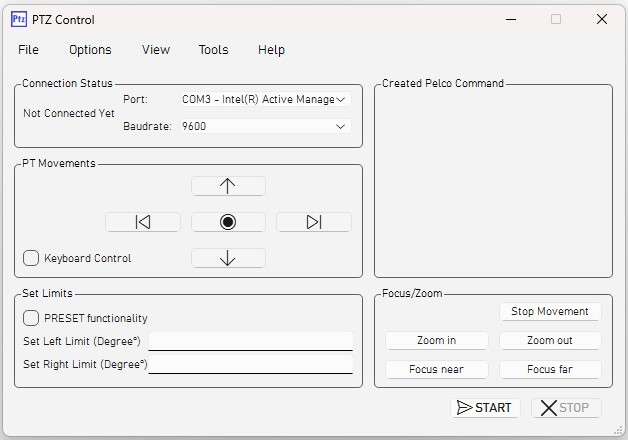

# Pan Tilt Zoom Control Software

## Overview
The Pan Tilt Zoom (PTZ) Control Software allows you to control your PTZ cameras through a single, user-friendly interface. This application provides seamless control over the pan, tilt, and zoom functionalities of your cameras, making it ideal for surveillance, live streaming, and other applications requiring precise camera movements.

## Features
- **Pan Control**: Move the camera horizontally.
- **Tilt Control**: Move the camera vertically.
- **Zoom Control**: Adjust the camera's zoom level.
- **Preset Positions**: Save and recall specific camera positions.
- **User-Friendly Interface**: Intuitive UI for easy control.
- **Multi-Camera Support**: Manage multiple PTZ cameras from one interface.
- **Real-Time Feedback**: Instant feedback on camera movements.

## Installation
### Prerequisites

## Configuration
- **Preset Positions**: Define and manage preset positions in the UI.

## Contributing
We welcome contributions! Please follow these steps:
1. Fork the repository.
2. Create a new branch (`git checkout -b feature-branch`).
3. Commit your changes (`git commit -m 'Add some feature'`).
4. Push to the branch (`git push origin feature-branch`).
5. Open a pull request.

## License
This project is licensed. See the [LICENSE](LICENSE) file for details.

## Contact
For any questions or feedback, please contact me via my profile on GitHub..

---

Thank you for using my Pan Tilt Zoom Control Software!
